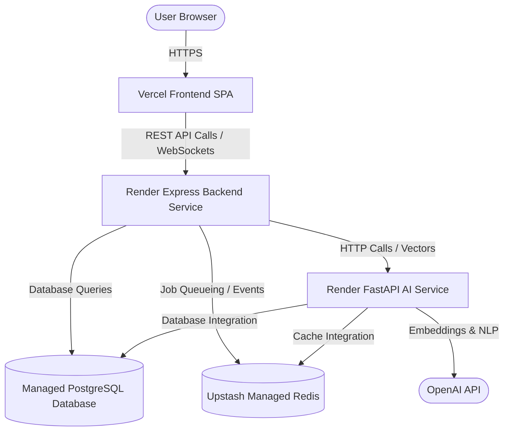

# SRE Deployment Audit & Architecture Review

This document provides a comprehensive SRE and system-level architectural audit of the **AI-Powered Intern Management System**. The goal is to analyze the currently deployed infrastructure across Vercel and Render, identify bottlenecks, assess potential vulnerabilities, and outline operational recommendations to achieve maximum reliability.

---

## 🏗️ 1. Architecture Map

The system follows a modern decoupled multi-tier architecture:



---

## 📊 2. Deployment Audit & Analysis

Below is a detailed analysis of each system layer, including current setup, potential vulnerabilities, and architectural observations.

### 2.1 Frontend Layer (Vercel)
* **Hosting Platform**: Vercel
* **Tech Stack**: React 19, Vite, TailwindCSS (v4)
* **Audit Observations**:
  - Highly optimized global CDN delivery. Edge caching works seamlessly.
  - Deployment is highly reliable with fast rollback features.
  - Zero server-side runtime compute is needed since it compiles down to pure static HTML/JS assets.
* **Potential Risks**:
  - API endpoints are hardcoded in the frontend build if not carefully managed.
  - Client-side error monitoring is missing (e.g., Sentry for React).

### 2.2 Backend Gateway Service (Render Web Service)
* **Hosting Platform**: Render
* **Tech Stack**: Node.js, Express, TypeScript, Prisma, BullMQ, Socket.IO
* **Audit Observations**:
  - Runs in a containerized environment.
  - Automatically manages port bindings.
  - Connects to PostgreSQL database via Neon and Redis via Upstash.
* **Potential Risks**:
  - Render free tier spun down during inactivity (cold-start delay up to 50 seconds).
  - Heavy background processing (Excel export, email jobs) occurs in the same container instance, which could trigger out-of-memory (OOM) crashes under high traffic.
  - Socket.IO web socket state is localized to the single server memory unless scaled via the Redis adapter.

### 2.3 AI Microservice (Render Web Service)
* **Hosting Platform**: Render
* **Tech Stack**: FastAPI, Uvicorn, XGBoost, FAISS, PyMuPDF
* **Audit Observations**:
  - Implements dedicated endpoints for resource-heavy operations (resume parsing, RAG).
  - Keeps Python dependencies fully isolated from the main Node.js backend.
* **Potential Risks**:
  - Model load time is high (SentenceTransformer initialization takes ~5-10s at boot).
  - High RAM usage due to FAISS index and transformer model storage.
  - Render free tier cold-start is highly disruptive due to the model loading latency.

### 2.4 Database & Cache Layers (Neon & Upstash)
* **PostgreSQL (Neon)**:
  - Excellent serverless scaling, but database connections can spike under load.
  - Automatic indexing is not enabled.
* **Redis (Upstash)**:
  - Restrictive free-tier quotas could cause BullMQ workers to fail once the daily request limit is reached.

### 2.5 Docker Configuration
* **Audit Observations**:
  - Standard Dockerfiles exist for each service (`frontend/`, `backend/`, `ai_service/`).
  - `docker-compose.yml` orchestrates all tiers successfully for local environment simulation.
* **Potential Risks**:
  - Base images are not pinned to specific SHA signatures or slim variations, causing large image footprints.
  - CPU/Memory constraints are not explicitly enforced in `docker-compose.yml`, which can cause a single leaky container to crash the entire developer daemon.

### 2.6 CI/CD Workflows
* **Audit Observations**:
  - Historical `.github/workflows` configurations were removed to streamline the repository footprint.
* **Potential Risks**:
  - High reliance on local builder environments to test changes before manual deployment triggers.
  - Manual deployment could lead to drifts between staging and production states.

---

## 💡 3. SRE Recommendations & Action Plan

To transition the system to an enterprise-ready production state, we recommend implementing the following corrective measures:

### Recommendation 1: Mitigate Free-Tier Cold Starts on Render
- **Action**: Upgrade Backend and AI services to Render's **Starter** tier ($7/month). This disables auto-sleeping and ensures zero-latency access for cohort management, chatbots, and instant geofenced attendance check-ins.

### Recommendation 2: Scale Real-Time Messaging & WebSockets
- **Action**: Verify the Backend Socket.IO server is utilizing `@socket.io/redis-adapter` to sync socket rooms across scaled container nodes. Use Redis as the message broker to permit seamless horizontal scaling.

### Recommendation 3: Implement Sentry React SDK in Frontend
- **Action**: Install `@sentry/react` in the frontend client. Set up global error boundaries to log uncaught React runtime exceptions and measure web vitals telemetry.

### Recommendation 4: Connection Pooling for Prisma
- **Action**: Use Neon's pooled connection strings (port `5432` with pooling or PgBouncer). This prevents "Too Many Connections" errors on PostgreSQL during sudden usage spikes (e.g., when a large cohort of interns logs in at the exact same hour).

### Recommendation 5: Optimize Docker Image Footprints
- **Action**: Use specific alpine base images in Dockerfiles. For example:
  - Node services: `node:20-alpine` instead of `node:latest`
  - Python AI service: `python:3.11-slim` instead of `python:latest`
- **Action**: Add explicit resource limits in production orchestrations:
  ```yaml
  deploy:
    resources:
      limits:
        cpus: '0.50'
        memory: 512M
  ```

### Recommendation 6: Reintroduce Lean GitHub Actions CI
- **Action**: Re-enable a lightweight GitHub Actions workflow for pull requests targeting `main` to run basic linters and test suites. This guarantees that code merges never break database migrations or the TypeScript compile cycle.
